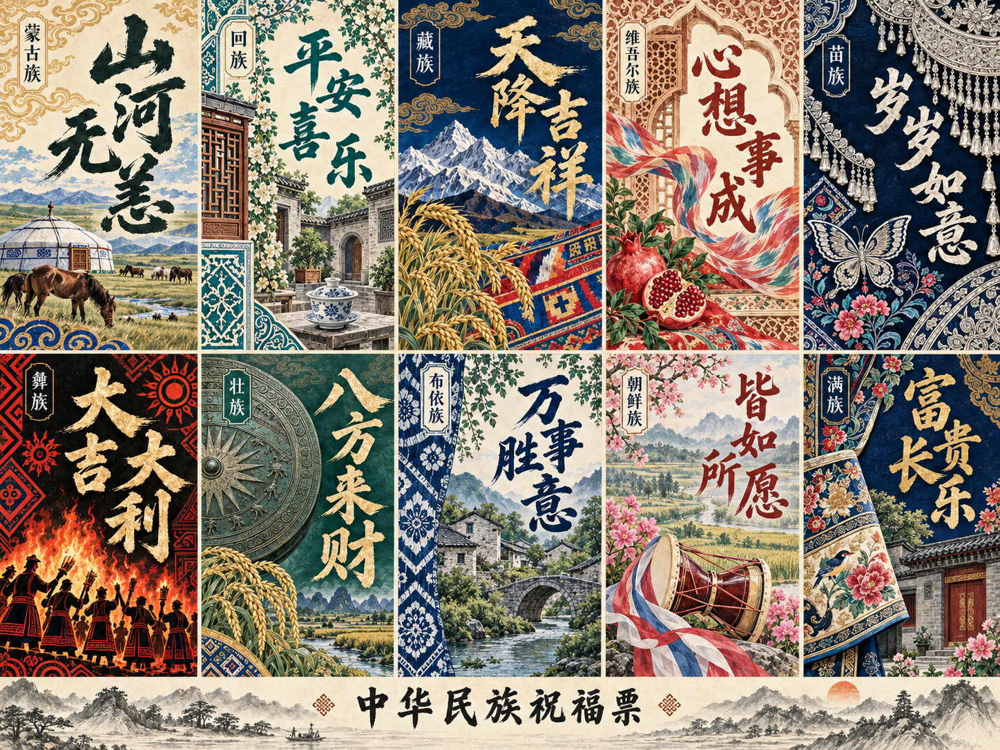
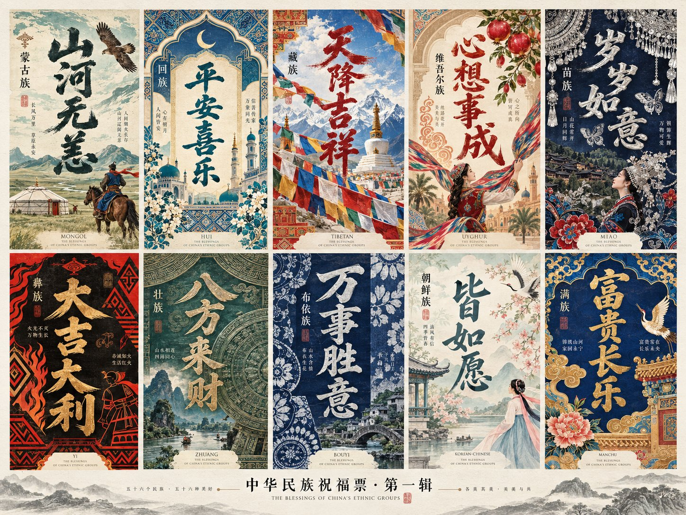
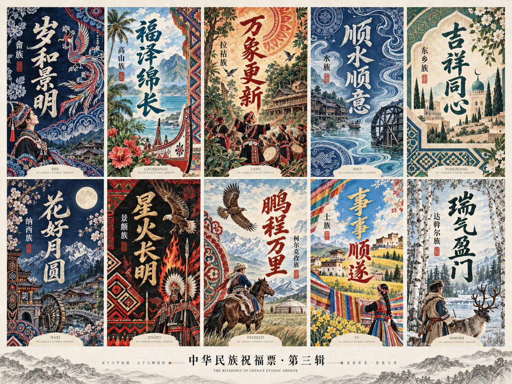
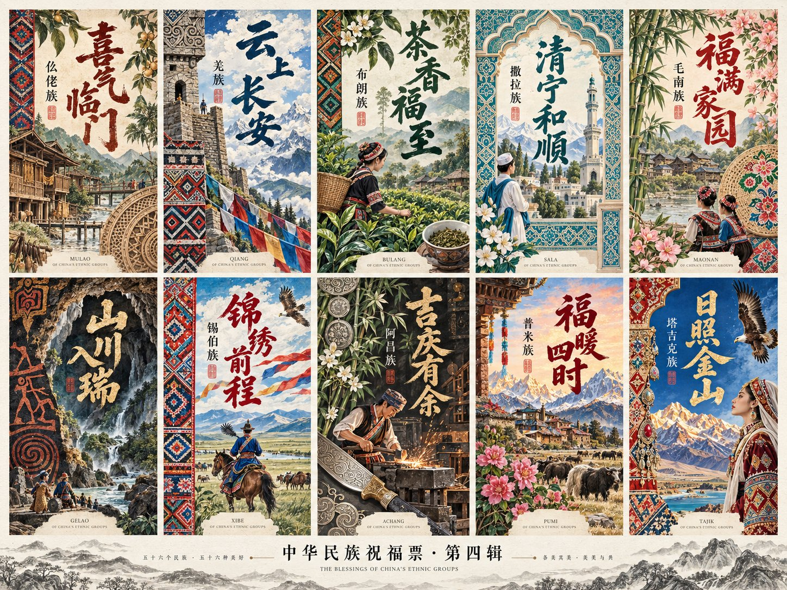
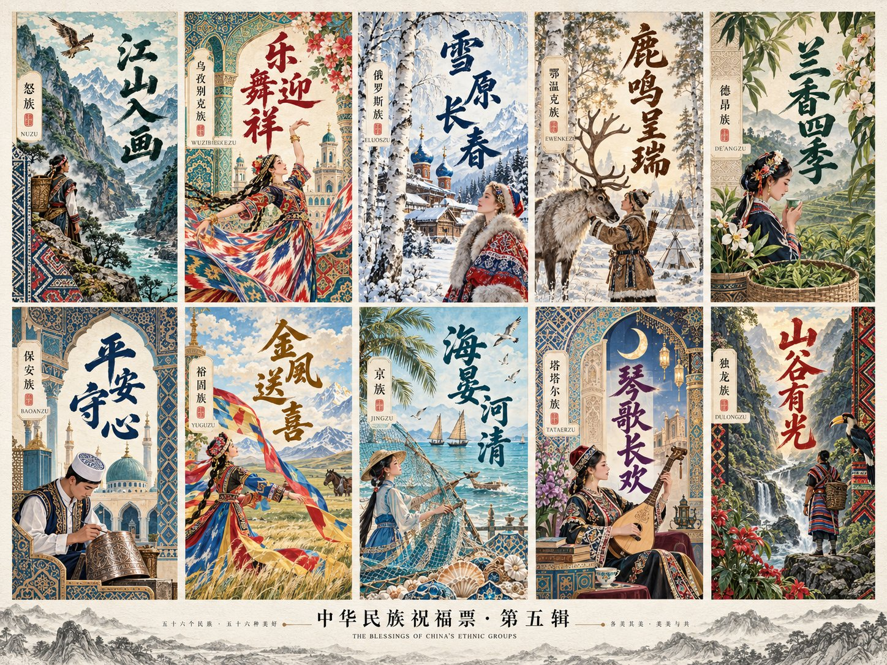

<div align="center">

# 中华民族祝福票

### 把一句祝福，写进山河与民艺。

[](LICENSE)
[](https://github.com/dososo/zhonghua-blessing-ticket/releases/latest)
[](https://github.com/dososo/zhonghua-blessing-ticket/actions/workflows/test.yml)

[下载 Skill](https://github.com/dososo/zhonghua-blessing-ticket/releases/latest) · [看介绍视频](#视频介绍) · [三步安装](#安装) · [看六辑图集](#六辑一览) · [一句话使用](#一句话使用)

</div>



*一幅画里，十句祝福各有自己的笔势、工艺与山河。上图由 v3 流程原生生成，作者已确认效果；实际尺寸 1448×1086。*

---

## 它是什么

一个供 Codex 使用的中华民族祝福票 Skill。输入一个少数民族和一句中文祝福，让大字书法、细密纹饰、地方景观与手工艺共同组成一张票卡。

它固定在已认可的「山河锦意」审美体系中：古典民艺印刷、清楚的书法主视觉、装饰性的山河层次，以及浅纸、深靛、青绿、朱红之间的冷暖呼应。**主标题与图案一次生成**，不会默认先做无字底图再贴文字。

单张可以用来送祝福、作壁纸或分享；总览可以把同一辑的十个设计放在一幅画布里观看。图像模型由宿主提供，Skill 负责设计记录、参考输入和验收流程。

## 视频介绍

从一句话调用，到六辑作品与三种交付形式。

<p align="center">
  <a href="https://github.com/dososo/zhonghua-blessing-ticket/releases/download/v3.0.0/zhbt-promo-16x9.mp4">
    
  </a>
</p>
<p align="center">
  40.8 秒 · 16:9 · 1080p<br>
  <a href="https://github.com/dososo/zhonghua-blessing-ticket/releases/download/v3.0.0/zhbt-promo-16x9.mp4">下载 MP4 观看完整介绍</a>
</p>

## 一句话使用

安装后，在具备原生图像工具的 Codex 新会话中输入：

```text
使用 $zhonghua-blessing-ticket：苗族，大吉大利，3:4。
```

```text
使用 $zhonghua-blessing-ticket：藏族，天降吉祥，1080×2336留白版。
```

```text
使用 $zhonghua-blessing-ticket：生成第一辑01—10的十民族祝福票总览，严格沿用内置认可图的绘画和印刷气质。
```

用户只必填民族与祝福词。单张默认 3:4，总览自带默认祝福。继续说「换一版」「颜色更沉静」「只修正这个错字」或「继续下一辑」，即可在同一会话中接着做。

---

## 六辑一览

以下六张为作者提供并授权收录的系列展示图，覆盖 55 个少数民族的创作方向。每张实际尺寸均为 **1448×1086**；前五辑各十卡，第六辑五卡。它们用于介绍项目，不等于本版本已逐张生成并验收 55 张独立作品。图中文字与文化细节仍需按具体用途复核，来源与用途见[素材说明](ASSETS.md)。

### 第一辑 · 01—10

蒙古族、回族、藏族、维吾尔族、苗族、彝族、壮族、布依族、朝鲜族、满族。



### 第二辑 · 11—20

侗族、瑶族、白族、土家族、哈尼族、哈萨克族、傣族、黎族、傈僳族、佤族。


### 第三辑 · 21—30

畲族、高山族、拉祜族、水族、东乡族、纳西族、景颇族、柯尔克孜族、土族、达斡尔族。



### 第四辑 · 31—40

仫佬族、羌族、布朗族、撒拉族、毛南族、仡佬族、锡伯族、阿昌族、普米族、塔吉克族。



### 第五辑 · 41—50

怒族、乌孜别克族、俄罗斯族、鄂温克族、德昂族、保安族、裕固族、京族、塔塔尔族、独龙族。



### 第六辑 · 51—55

鄂伦春族、赫哲族、门巴族、珞巴族、基诺族。


---

## 你能用它做什么

| 你想做的 | 怎么说 | 交付形式 |
|---|---|---|
| 送一句自己的祝福 | 苗族，大吉大利，3:4 | 一张完整祝福票，目标 1080×1440 |
| 做一张留白更舒展的长票 | 藏族，天降吉祥，长票留白版 | 一张独立长票，目标 1080×2336 |
| 看一整辑的不同设计 | 生成第一辑01—10的十卡总览 | 一张 5×2 总览画布 |
| 接着看下一辑 | 继续下一辑 | 接续当前会话的批次；最后一辑为五卡 |
| 保留好画面，只修文字 | 保持图案，只修正这个错字 | 有限次数的定向编辑，再逐字检查 |

**目标像素与真实输出分别记录。** 工具无法给出准确目标尺寸时，保留原生文件并报告实际大小。总览的小格不会被裁切放大后称作独立原生高清卡。

## 这一版包含什么

| 内容 | 数量与作用 |
|---|---|
| 民族设计记录 | 55 份，注明地域范围、主锚点、辅助元素和防串项 |
| 内置视觉参考 | 1 张认可总览、10 个低分辨率局部，只用于风格校准 |
| 文字设计配方 | 13 种字骨、25 种工艺、12 种按字数筛选的布局 |
| 画面构图 | 8 种构图关系，保持同一套绘画和印刷气质 |
| 系列方案 | 六辑：10、10、10、10、10、5 |
| 使用与工程工具 | 自包含 Skill、安全安装器、离线编译器、回执、可选无损拼版、测试与发布工作流 |

字骨与工艺都是设计描述，包内不分发字体。完整条目见[55 民族风格库](docs/55民族风格库.md)。

---

## 安装

需要具备原生图像生成能力的 Codex。自动安装脚本需要 Python 3.9 或更新版本，无需安装 Python 包；Skill 本身不安装图像模型，也不要求在聊天中提供密钥。

1. 从 [最新 Release](https://github.com/dososo/zhonghua-blessing-ticket/releases/latest) 下载 `zhbt-v3.0.0.zip`，解压整个仓库。
2. 在解压目录运行 `bash scripts/install_codex_macos.sh`。
3. 在 Codex 新会话中调用 `$zhonghua-blessing-ticket`；未显示时重启应用。

也可以从源码安装：

```bash
git clone https://github.com/dososo/zhonghua-blessing-ticket.git
cd zhonghua-blessing-ticket
bash scripts/install_codex_macos.sh
```

### 升级与其他安装方式

已有同名 Skill 时：

```bash
bash scripts/install_codex_macos.sh --replace
```

安装到 `~/.agents/skills/zhonghua-blessing-ticket`，旧目录先备份到 `~/.agents/zhbt-backups/`。安装器不修改全局 Codex 配置，不联网，不启动 MCP。若还启用了旧同名插件，请在 Codex 中停用旧入口，避免版本并存。

项目级安装：

```bash
python3 scripts/install.py --scope project --project /你的项目目录
```

没有 Python 时，将 `skills/zhonghua-blessing-ticket` 整个目录复制到 `~/.agents/skills/`；已有目录先备份。使用 `$skill-installer` 时也应安装这个完整目录，包含 assets、data、references 和 scripts。

公开 GitHub 仓库供克隆安装，不代表已经上架官方插件目录。

## 它怎样生成

1. 读取当前民族的设计记录，锁定用户原始祝福文字。
2. 打开并实际附加 Skill 内置认可图，让风格有具体参照。
3. 由宿主原生工具同时生成主标题、纹样、山河与工艺效果。
4. 打开真实输出，逐字核对标题、比较画风、检查文化形制并记录实际尺寸。
5. 必要时定向修复：单张最多两次，总览最多一次。

单张默认不显示民族名；总览允许目录性小标签。不擅自替换祝福词或转换简繁，不增加年份、日期、生肖纪年和随机小字。

精细复现时可以使用可选离线编译器：

```bash
python3 scripts/zhbt.py single --ethnic 苗族 --blessing 大吉大利 --format 3:4 --out outputs/miao.json
python3 scripts/zhbt.py canvas --start 1 --count 10 --out outputs/canvas-01.json
python3 scripts/zhbt.py all --out-dir outputs/all-55
```

这些命令只编译方案和提示词，不会自行调用图像模型。实际生图检查方法见[原生生图验证](docs/SMOKE_TEST.md)。

## 文化与文字

55 份记录各有有限的地域与创作范围。一个设计不能代表某个民族的全部支系、服饰和信仰，共有工艺也不归单一民族独占。

审美参考与文化证据分别使用：具体纹样、冠饰、乐器、宗教建筑需有可信来源；发现展示图中的误用时，不应继续复制。主字虽然有准确文字锁，生成后仍须看图核验。见[文化规则](skills/zhonghua-blessing-ticket/references/culture-policy.md)与[资料来源](docs/资料来源.md)。

## 隐私与素材

安装器和离线编译器不联网；原生生图会把你选择的提示词和参考图交给宿主图像服务，数据处理规则由该服务决定。

公开展示图已去除 EXIF 和文本等元数据，保留原始尺寸与像素。仓库和 Release 不收录本地过程记录、用户历史、原始日志、私有参考、凭证或字体。详见[隐私说明](PRIVACY.md)和[素材说明](ASSETS.md)。

## 开发与验证

```bash
python3 -m unittest discover -s tests -v
python3 scripts/zhbt.py validate
python3 scripts/release_check.py
python3 scripts/build_release.py
```

验证覆盖安装与备份、精确字序、55 民族与双规格编译、参考图完整性、发布内容和可选无损拼版。公开的 [Actions](https://github.com/dososo/zhonghua-blessing-ticket/actions) 提供可复查的执行结果。

v3 已完成一次真实参考图输入和原生十卡总览生成，十句标题经视觉核对，作者已确认效果。六辑介绍图来自作者提供的展示素材，不能据此宣称 55 民族逐张生成、全部中文或文化专家审查通过。具体范围见[验证边界](docs/验证边界.md)。

```text
assets/       仓库主图、六辑展示与来源记录
skills/       可完整安装的自包含 Skill
scripts/      安装、校验与发布包构建
examples/     公共方案与提示词示例
tests/        自动化回归测试
docs/         使用、文化资料与验证边界
.github/      问题模板和持续集成
```

## 贡献与许可

欢迎提交可复现的错误与文化修正。文化条目请附地域、支系、可信资料及具体错误；审美修改请给出与现有基准的对照。见[贡献指南](CONTRIBUTING.md)和[安全说明](SECURITY.md)。

代码与原创文档采用[木兰宽松许可证第 2 版](LICENSE)。图像仅在贡献者可许可的权利范围内提供，传统文化、知识和纹样不被本项目独占。

## 作者

**爆裂队长 NEXT（BLCaptain）**

- GitHub：[dososo](https://github.com/dososo)
- X：[@thinkszyg](https://x.com/thinkszyg)
- 邮箱：[blteam2026@outlook.com](mailto:blteam2026@outlook.com)
